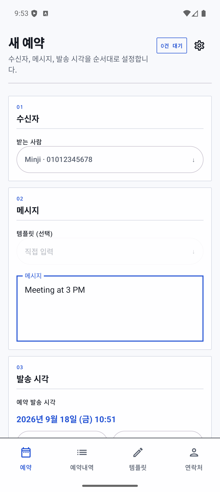

# SMS Scheduler

연락처와 메시지 템플릿을 관리하고, 원하는 시각에 SMS를 자동 발송하는 Android 앱입니다.

<p align="center">
  
</p>

## 주요 기능

- 연락처를 직접 추가하거나 기기 연락처에서 가져오기
- 자주 쓰는 메시지를 템플릿으로 저장
- `{{이름}}`, `{{회사명}}` 같은 누름틀 변수 자동 치환
- 날짜와 시간을 지정해 SMS 발송 예약
- 발송 1시간 전 사전 알림
- 발송 완료 및 실패 상태 확인
- 알림을 눌러 해당 예약 내역으로 바로 이동
- 재부팅 후 대기 중인 예약 자동 복원
- 시스템, 밝게, 어둡게 테마 지원

## 기술 스택

- Kotlin
- Jetpack Compose 및 Material 3
- Room
- Hilt
- AlarmManager 및 BroadcastReceiver
- SharedPreferences
- Gradle Kotlin DSL, Version Catalog, KSP

## 동작 구조

```text
Compose Screen
    ↓
AppState
    ↓
AppStore               SettingsStore
    ↓                       ↓
Room Database          SharedPreferences

Compose / Receiver
    ↓
MessageAlarmScheduler → AlarmManager → BroadcastReceiver
```

- UI 데이터는 `AppState`가 관리하고 `AppStore`를 통해 Room에 저장합니다.
- 앱 설정은 업무 데이터와 분리해 `SettingsStore`에 저장합니다.
- 예약 시각이 되면 `SmsAlarmReceiver`가 저장된 상태를 다시 확인한 후 SMS를 발송합니다.
- 예약 취소, 발송 결과 기록, 사전 알림 정리도 같은 예약 ID를 기준으로 처리합니다.

자세한 개발 규칙과 파일별 책임은 [AGENTS.md](AGENTS.md)를 참고하세요.

## 요구 사항

- Android Studio 또는 Android SDK
- JDK 17
- Android 12(API 31) 이상 기기
- SMS 발송 기능이 있는 실제 Android 기기

에뮬레이터에서는 화면과 예약 흐름을 확인할 수 있지만 실제 SMS 발송은 보장되지 않습니다.

## 실행 방법

저장소를 받은 뒤 프로젝트 루트에서 디버그 APK를 빌드합니다.

```bash
./gradlew :app:assembleDebug
```

생성된 APK는 다음 위치에서 확인할 수 있습니다.

```text
app/build/outputs/apk/debug/app-debug.apk
```

Android Studio에서 `app` 구성을 선택해 연결된 기기나 에뮬레이터로 실행할 수도 있습니다.

## 필요한 권한

앱의 모든 기능을 사용하려면 다음 권한과 시스템 설정이 필요합니다.

| 권한 또는 설정 | 용도 |
|---|---|
| SMS 발송 | 예약된 문자 발송 |
| 알림 | 사전 알림과 발송 결과 표시 |
| 정확한 알람 | 지정한 시각에 최대한 정확하게 실행 |
| 배터리 최적화 예외 | 백그라운드 예약 실행 안정성 향상 |
| 부팅 완료 수신 | 기기 재부팅 후 예약 복원 |

정확한 알람 권한이 없을 때도 예약은 등록되지만, 시스템 정책에 따라 발송 시각이 조금 늦어질 수 있습니다.

## 테스트

JVM 단위 테스트:

```bash
./gradlew :app:testDebugUnitTest
```

연결된 기기 또는 에뮬레이터에서 계측 테스트:

```bash
./gradlew :app:connectedDebugAndroidTest
```

전체 디버그 빌드 확인:

```bash
./gradlew :app:assembleDebug
```

## 프로젝트 구조

```text
app/src/main/java/com/wonddak/sms/
├── data/          # Room, 설정 저장소, 모델 변환
├── di/            # Hilt 모듈
├── model/         # 앱 모델과 템플릿 엔진
├── scheduling/    # 알람, SMS 발송, 알림, 재부팅 복원
├── ui/            # Compose 화면과 UI 상태
├── MainActivity.kt
└── SmsSchedulerApplication.kt
```
